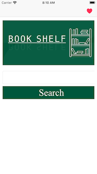
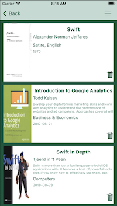
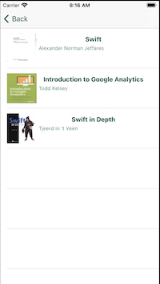

# bookShelfApp
bookshelf app is an app will allow you to search for books by book's title or an author 
bookmark a book for later reference 

# how to start the app
1. first you need to get a google API key dashboard https://console.cloud.google.com/apis
2. click on credentials from left nav
3. create a new api key 
4. navigate to the file 'bookShelfApp/My Book shelf/utils/Constants.swift' 
5. replace `GOOGLE_API_KEY` with your key 

# Screenshots 

# requirement 
1. `xCode version 12.5`
2. `iOS 14.5`
3. `Swift 4.0`
